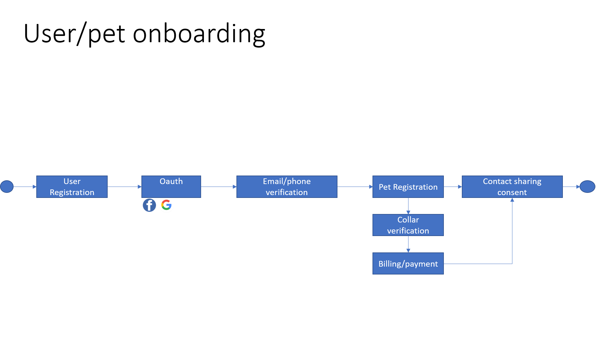
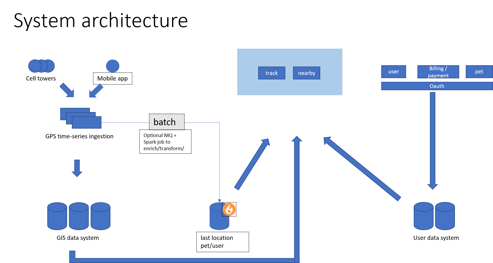

# Track My Pet Design

## Assumptions
 1. TrackMyPet application will capture 5% of US pet owners in 3 years
 2. Active Users 10% of total users at any given time. Peak users 30%.
 3. Target Country is US
 4. Shoestring budget implies that client does not have intention to host this on private infrastructure, hence IaaS/PaaS providers will be used. FOSS will be preferred.
 5. Time granularity for the GPS data is assumed to be 1 min.

## Tradeoff and value proposition
 
 ### Data retention ( BASIC vs PREMIUM users)
- Basic users can access only 24 hrs of tracking data. 
- Assuming distress situations ( like lost pet ) will play a major role in conversion to PREMIUM feature ( 30 days tracking history ). We should not discard - data older than 24 hrs for Basic Users. 
- We can always lighten the storage load by storing a week's data for BASIC users.But, giving access to only 24 hrs worth of data.
 

## Volumetric
- Data taken from [American Veterinary Medical Association](https://www.avma.org/resources-tools/reports-statistics/us-pet-ownership-statistics)
- 90 million households in US. Assuming trackmypet captures 10% of market in 3 years. hence, 9 million owners 
- 137 million pets in US owned by these households. projection in 3 years : 14 million
- Ingestion rate of location data: 14 mil/60 = **232 K updates/sec**
- location data storage volume: 30 days * 24 * 60 * 60 * 232K = **604 billion records**
 ( disregarding BASIC users for a lavish allowance in growth)
- cumulative userinfo data: 9mil * 5KB = **45 GB**  
- each location update : collarID + transmitterID + GPS Data + timestamp => 8B + 4B + 6B + 6B = **24B**
- cumulative location info data: 24B * 604 Billion = **14 TB**

### System Design considerations
    
#### Database for user information:
Requirements:

    1. transactional 
    2. READ heavy 
Options:  

    1. Any RDBMS  
    2. NOSQL for document type modelling  
Pros:  

     Simple architecture  
Cons:  

    scalability issues depending upon projection accuracy. NOSQL maybe preferred in this scenario.

#### Database for Location information
 ##### Requirements:  
    1. transactional
    2. WRITE heavy
    3. sharding/partitioning : preferably geo-partitioning
    4. GEOMetric capability preferred ( calculate distance between points).If, database does not support this than hadoop/spark jobs to perform this calculation.
 
 ##### Options:
    1. Geo Distributed RDBMS : Cockroach DB ( cloud distribution is another option)
    2. cloud database : Google spanner ( similar products from other providers, based upon commercials)
       Cons: Cost
    3. columnar Databases 
       Cons: Scalability    
    4. Big Data    
    Pros:
    * scalability,     
    * pre-ingestion calculation ( gps to point conversion, enrichment),    
    * Maybe a feature to provide dynamic (firebase) updates to user mobiles about nearby users    
        Cons:    
            Maintenance Cost    
    

### GPS Data ingestion:
Design:

     1. Partioning of GIS data can be based upon collarID of pets. 
     2. Geo partioning can be another lucrative option if we see a global presence of TrackMyPet )
     3. Location updates from the mobile-app users will also need to be stored ( This will help in finding nearby users)
     4. For the nearby users functionality, There needs to be a transient in-memory inforation about last reported location from each pet/user along with timestamp

#### Use Case diagram

#### Architecture diagram

#### Implementation
Due to some issues in spring libraries i wasn't able to implement the API's. I have spent 10 hrs already on this.
Kindly Excuse.